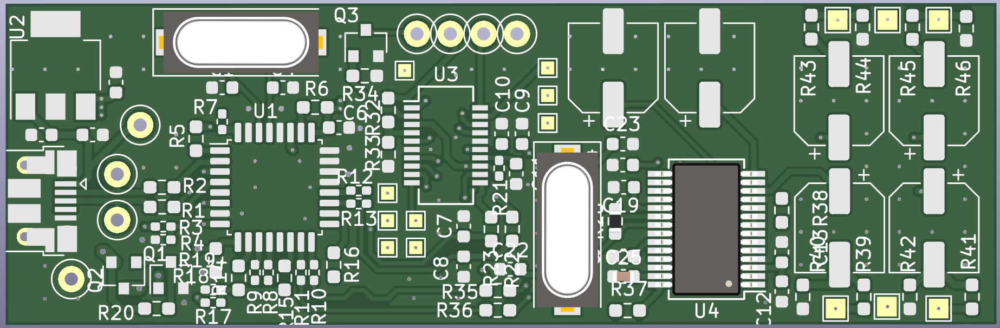
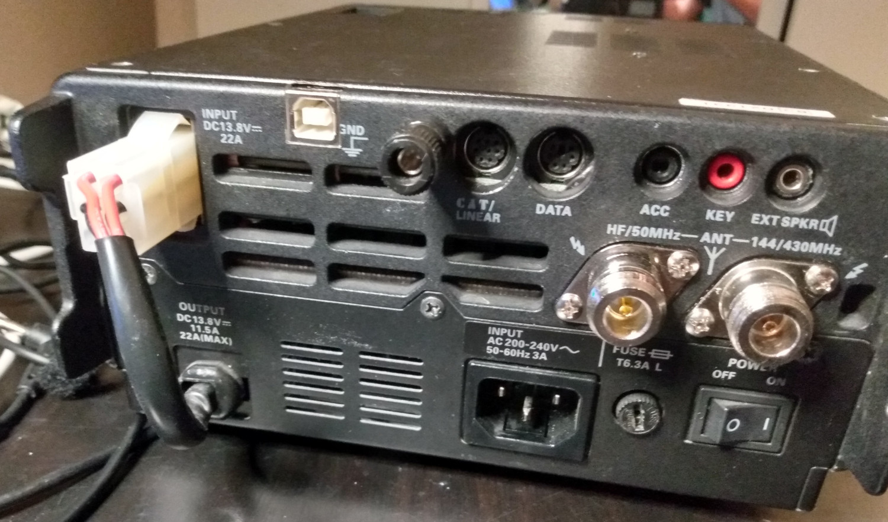

# USB Interface

primitive and simple USB interfave for classic Ham Radio transceivers. 
- Brings the TRX to the 21st century and makes the operation of digi modes reliable and easy. 
- No more cables and adapters 
- KiCad based

Fits into Yaesu FT987 and FT817 (no Filters installed).

Components used:
- USB-Hub TUSB2036
- UART Interface: FT231XS
- Soundcard PCM2906[C] 

Down Side:
- only uses half of dynamic range at RX audio-chain as Yaesu TRX provide half of amplitude the IC can handle.
